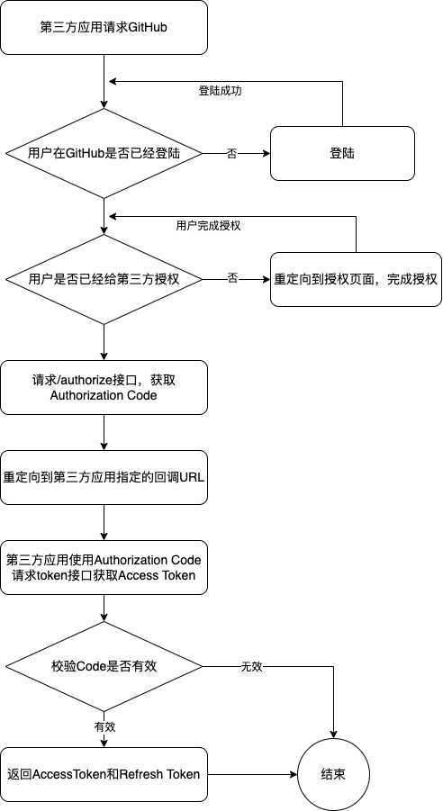
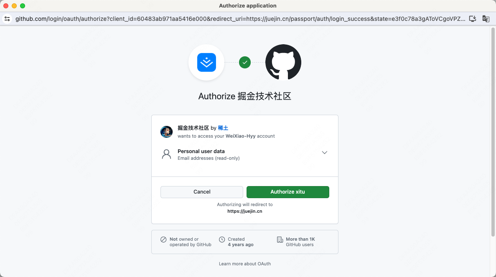
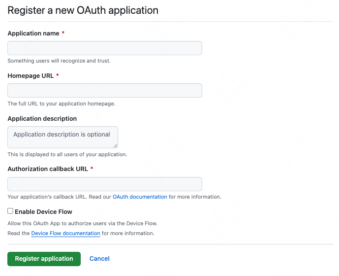
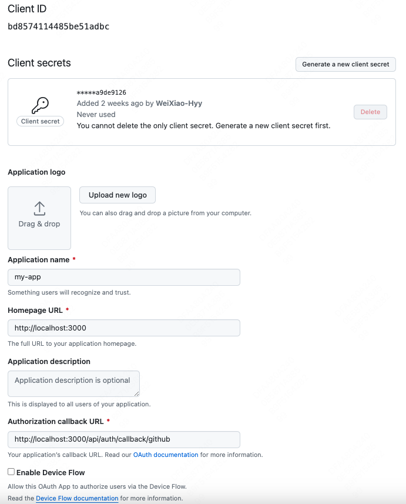

# oauth2

## 引言

读了《设计模式之美》和《凤凰架构》架构安全篇之后，决定写一个OAuth2.0的认证流程的Demo，也算是一个阶段性的总结，具体原理实现见《凤凰架构》(架构安全设计篇)。

涉及到的源码可以从[https://github.com/WeiXiao-Hyy/oauth2](https://github.com/WeiXiao-Hyy/oauth2)获取，欢迎Star!

## OAuth2.0原理

> 主要解决的问题

面向解决第三方应用(Third-Party Application)的认证授权协议，使用Token代替用户密码作为授权的凭证。

1. 有了令牌之后，哪怕令牌被泄漏，也不会导致密码的泄漏
2. 令牌上可以设定访问资源的范围以及时效性
3. 每个应用都持有独立的令牌，哪个失效都不会波及其他

> OAuth2.0一共提出了四种不同的授权方式：

- 授权码模式(Authorization Code)
- 隐式授权模式(Implicit)
- 密码模式(Resource Owner Password Credentials)
- 客户端模式(Client Credentials)

本文介绍和实现的是授权码方式。

### OAuth2.0流程图

1. client请求授权服务端，获取Authorization Code；
2. client通过Authorization Code再次请求授权服务端，获取Access Token；
3. client通过服务端返回的Access Token获取用户的基本信息。

流程图如下所示:

> 第一次使用github账号应用来登陆掘金，需要进行授权

掘金即是第三方应用, 请求GitHub。

> 注册一个新的OAuth Application

如果我们需要使用GitHub账号来关联我们自己的第三方应用则需要完整走一遍OAuth2.0流程。

GitHub生成的client_id, client_secret(密钥), redirect_uri, homepage_url, application_name等等。

### clientId如何生成唯一的？

## 对比

### 和JWT对比

### 和Cookie-Session对比

### 谈谈State参数为什么可以防止CSRF攻击

## 代码实现

### 服务端

### 客户端

### 部署与测试

## 参考资料

- [https://icyfenix.cn/architect-perspective/general-architecture/system-security/](https://icyfenix.cn/architect-perspective/general-architecture/system-security/)
- [https://time.geekbang.org/column/intro/100039001](https://time.geekbang.org/column/intro/100039001)
- [https://docs.github.com/en/apps/oauth-apps/building-oauth-apps/authorizing-oauth-apps](https://docs.github.com/en/apps/oauth-apps/building-oauth-apps/authorizing-oauth-apps)
- [https://juejin.cn/post/6844903668861534215#heading-4](https://juejin.cn/post/6844903668861534215#heading-4)