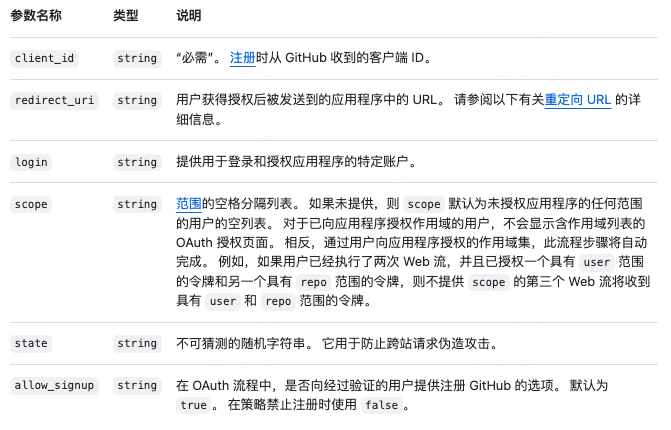
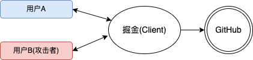

# oauth2

## 引言

读了《设计模式之美》和《凤凰架构》架构安全篇之后，决定写一个OAuth2.0的认证流程的Demo，也算是一个阶段性的总结，具体原理实现见《凤凰架构》(
架构安全设计篇)。

涉及到的源码可以从[https://github.com/WeiXiao-Hyy/oauth2](https://github.com/WeiXiao-Hyy/oauth2)获取，欢迎Star!

## OAuth2.0原理

> 主要解决的问题

面向解决第三方应用(Third-Party Application)的认证授权协议，使用Token代替用户密码作为授权的凭证。

1. 有了令牌之后，哪怕令牌被泄漏，也不会导致密码的泄漏
2. 令牌上可以设定访问资源的范围以及时效性
3. 每个应用都持有独立的令牌，哪个失效都不会波及其他

> OAuth2.0一共提出了四种不同的授权方式：

- 授权码模式(Authorization Code)
- 隐式授权模式(Implicit)
- 密码模式(Resource Owner Password Credentials)
- 客户端模式(Client Credentials)

本文介绍和实现的是授权码方式。

### OAuth2.0流程图

1. client请求授权服务端，获取Authorization Code；
2. client通过Authorization Code再次请求授权服务端，获取Access Token；
3. client通过服务端返回的Access Token获取用户的基本信息。

流程图如下所示:

> 第一次使用github账号应用来登陆掘金，需要进行授权

掘金即是第三方应用, 请求GitHub。

> 注册一个新的OAuth Application

如果我们需要使用GitHub账号来关联我们自己的第三方应用则需要完整走一遍OAuth2.0流程。

GitHub生成的client_id, client_secret(密钥), redirect_uri, homepage_url, application_name等等。

### clientId如何生成唯一的

TODO: Id Generator实现，读完《设计模式之美》更新

### 和JWT以及Cookie-Session对比

参考《凤凰架构》架构安全篇 [https://icyfenix.cn/architect-perspective/general-architecture/system-security/authorization.html](https://icyfenix.cn/architect-perspective/general-architecture/system-security/authorization.html)

### 谈谈State参数为什么可以防止CSRF攻击

观察GitHub OAuth2.0实现文档，可以观察到在`authroize`接口需要传递一个state参数，并且在redirect_uri重定向时原封不动传递回来，所以为什么可以防止CSRF攻击呢？

核心: 在于授权服务端进行token请求绑定时，会从session将本次会话的账号与生成access_token进行绑定，而对于用户是谁并不关心。

> 案例

1. 用户B登录`掘金`网站，并且选择绑定自己的`GitHub`账号;
2. `掘金`网站将用户B重定向到`GitHub`，由于他之前已经登录过`GitHub`，所以`GitHub`直接向他显示是否授权掘金访问的页面;
3. 用户B在点击"同意授权"之后，截获`GitHub`服务器返回的含有`authorization code`参数的HTTP响应;
4. 用户B精心构造一个Web页面，它会触发`掘金`网站向`GitHub`发起令牌申请的请求，而这个请求中的`authorization code`参数正是上一步截获到的`code`;
5. 用户B将这个Web页面放到互联网上，等待或者诱骗受害者用户A来访问;
6. 用户A之前登录了`掘金`网站，只是没有把自己的账号和其他社交账号绑定起来。在用户A访问了用户B准备的这个Web页面，令牌申请流程在用户A的浏览器里被顺利触发，`掘金`网站从`GitHub`那里获取到`access_token`，但是这个`token`以及通过它进一步获取到的用户信息却都是攻击者用户B;
7. `掘金`网站将用户B的`GitHub`账号同用户A的`掘金`账号关联绑定起来，从此以后，用户B就可以用自己的`GitHub`账号通过`OAuth`登录到用户A在`掘金`网站中的账号，堂而皇之的冒充用户A的身份执行各种操作;

## 代码实现

- auth-client: 客户端实现 
- auth-server: 服务端实现
- auth-common: 共同依赖

## 参考资料

- [https://icyfenix.cn/architect-perspective/general-architecture/system-security/](https://icyfenix.cn/architect-perspective/general-architecture/system-security/)
- [https://time.geekbang.org/column/intro/100039001](https://time.geekbang.org/column/intro/100039001)
- [https://docs.github.com/en/apps/oauth-apps/building-oauth-apps/authorizing-oauth-apps](https://docs.github.com/en/apps/oauth-apps/building-oauth-apps/authorizing-oauth-apps)
- [https://juejin.cn/post/6844903668861534215#heading-4](https://juejin.cn/post/6844903668861534215#heading-4)
- [https://www.jianshu.com/p/c7c8f51713b6](https://www.jianshu.com/p/c7c8f51713b6)